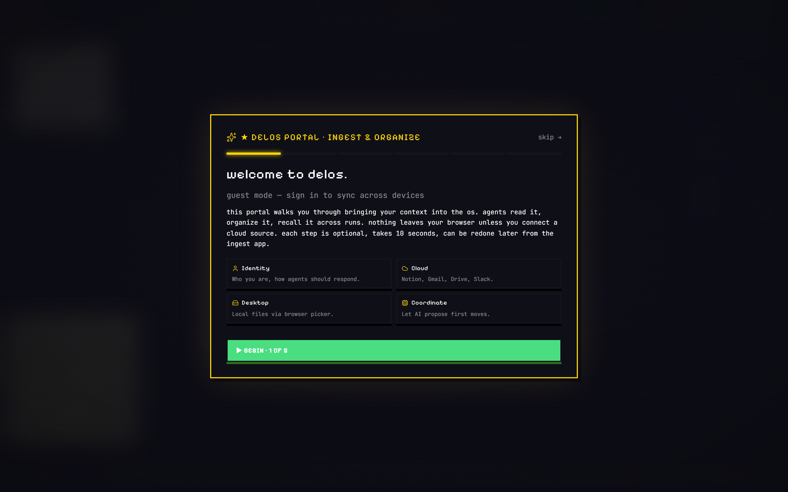
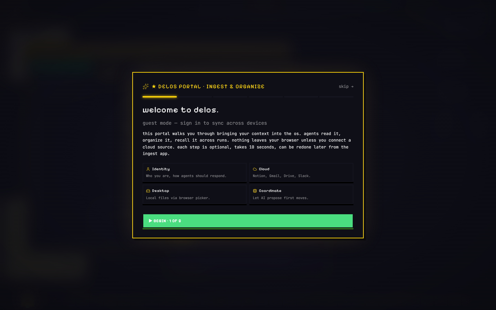
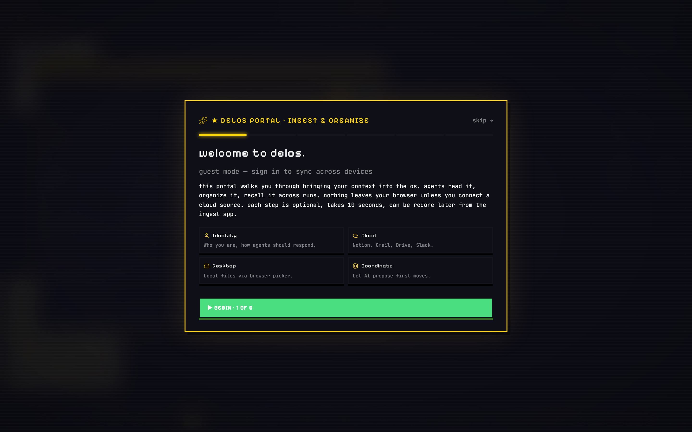
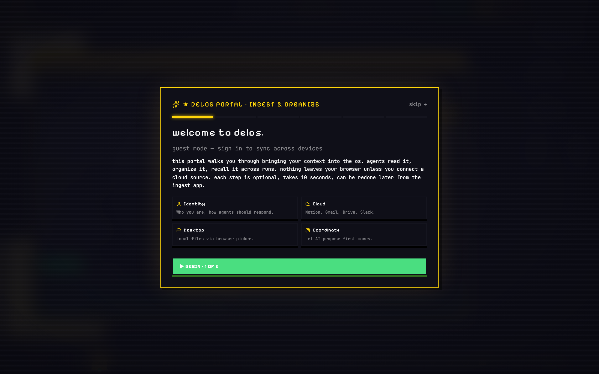
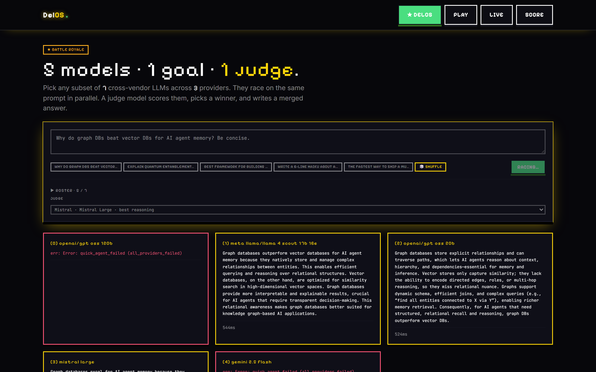
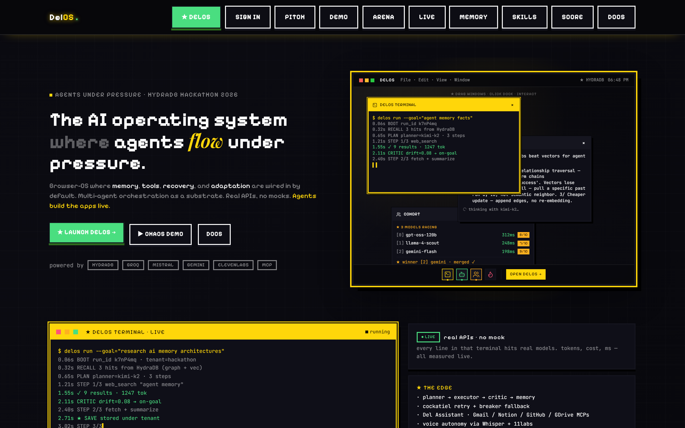

<div align="center">
  

  <h1>DelOS</h1>

  <p><strong>A browser operating system for AI agents.</strong> Voice, memory, code generation, model cohort racing, and a Chrome extension that performs complex browser tasks live on any page. All share one Hydra graph plus vector memory.</p>

  <p>
    <a href="https://delrio.vercel.app"></a>
    <a href="https://delrio.vercel.app/os?guest=1"></a>
    <a href="https://delrio.vercel.app/os?guest=1&demo=judge"></a>
    <a href="#chrome-extension"></a>
  </p>

  <p>
    <a href="docs/ARCHITECTURE.md">Architecture</a> ·
    <a href="docs/SCHEMA.md">Schema</a> ·
    <a href="docs/SECURITY.md">Security</a> ·
    <a href="submission/loom-script-FINAL.md">Loom script</a> ·
    <a href="submission/EVALUATION.md">Evaluation</a>
  </p>
</div>

<br>

<div align="center">
  <em>Built for the Agents Under Pressure HydraDB hackathon · May 2026 · solo by Vaibhav Lalwani</em>
</div>

<br>

---

## Two surfaces, one memory

| Surface | What it is | URL |
|---|---|---|
| **Website OS** | Twenty four real apps in a window manager. Voice agent, memory browser, code app builder, browser, arena, calendar, schedule. | [delrio.vercel.app/os?guest=1](https://delrio.vercel.app/os?guest=1) |
| **Chrome extension** | Three tabs. Mission runs complex browser tasks with Perplexity style in page overlay. Cohort races five models. Memory is cross synced. | [`/chrome-ext`](chrome-ext) |

Same Hydra tenant id flows through both. A run from the extension shows up in the website Memory app within a poll cycle.

## Screenshots

Captured live from https://delrio.vercel.app via Playwright at 1440x900 @2x DPI.
Regenerate with `node scripts/capture-screenshots.mjs`.

### OS desktop on first boot


### Judge demo running with narration card


### Memory Browser with seed entries plus typed source badges


### VibeCode + DelCode streaming a code app


### Five model arena race


### Landing page


## Quick start

### Run the website

```bash
git clone https://github.com/vaibhav4046/delos
cd delos
npm install
cp .env.example .env.local         # fill in keys, all optional except GROQ_API_KEY
npm run dev                        # http://localhost:3000
```

The OS lives at `http://localhost:3000/os?guest=1`. Guest mode skips
auth and uses an anonymous tenant id so the demo works without setup.

### Install the Chrome extension

1. Open `chrome://extensions`
2. Toggle **Developer mode** on (top right).
3. Click **Load unpacked**.
4. Point at the `chrome-ext` folder in this repo.
5. Pin the D logo icon to your toolbar.
6. Click the icon, the side panel opens.

By default the extension talks to `https://delrio.vercel.app`. To use a
local dev server, open the settings cog in the extension, change the
endpoint to `http://localhost:3000`, and save.

### Required environment variables

| Variable | Purpose | Required |
|---|---|---|
| `GROQ_API_KEY` | Primary LLM provider | Yes |
| `HYDRADB_API_KEY` | Memory backbone | Yes |
| `MISTRAL_API_KEY` | Critic in arena | Optional |
| `GOOGLE_API_KEY` | Gemini fallback | Optional |
| `NIM_API_KEY` | NVIDIA Nemotron planner | Optional |
| `ELEVENLABS_API_KEY` | Premium TTS | Optional |
| `BYTEZ_API_KEY` | Backup provider | Optional |

The cascade falls back through providers when any one rate limits. The
demo never stalls because of a single key.

## Use cases

### 1. Voice driven app building
> "Build me an investor CRM with a five stage kanban and a follow up reminder dock"

The voice agent parses the intent, opens VibeCode, picks the Investor
CRM domain cockpit, and streams a five page app into DelCode on the
right. Export as a zip or as a single HTML file.

### 2. Multi step browser research from the Chrome extension
> "Research the top three wireless earbuds under two hundred dollars for twenty twenty five and rank them"

The Mission agent plans, navigates a search results page, scrolls,
extracts content, summarizes, then chain re plans up to three rounds
until the goal is satisfied. Each step pulses a colored outline on
the actual page element it touches. Every screenshot lands in the
panel.

### 3. Endless conversation with browser memory
> "What about noise cancellation on the second pick?"

The follow up row in the Mission tab is always open. The agent has
prior context. It either re engages the browser if a new search is
needed, or answers from context with a follow up tag. Both write
to memory.

### 4. Cohort racing for hard questions
> "What is the best memory architecture for an agent OS?"

Five LLMs answer in parallel. A judge model scores them, picks the
winner, merges the answers, and writes the verdict to memory with an
arena source tag. Disagreement percentage shows on the scorecard.

### 5. Cross surface memory recall
> Save something on the website, recall it from the extension

A run on the website writes to Hydra under tenant id `delrio_demo`. The
extension opens, Memory tab refreshes, the entry is there. Same in
reverse. Tag the entry with `important`, search later, copy with one
click.

### 6. Schedule and reminders
> "Remind me to call Sarah at three pm tomorrow"

The voice agent parses the time via chrono, writes a scheduled action,
the schedule ticker fires at the right moment, a notification appears
in the notification center, and the entry shows in the calendar app.

## How it works

```
┌─────────────────────────────────────────────────────┐
│  Browser tab (delrio.vercel.app/os)                 │
│  ┌────────┬───────────┬─────────┬────────┬───────┐  │
│  │ Voice  │ VibeCode  │ Memory  │ Arena  │ ...   │  │
│  └────┬───┴─────┬─────┴────┬────┴───┬────┴───────┘  │
│       │         │          │        │               │
└───────┼─────────┼──────────┼────────┼───────────────┘
        │         │          │        │
        ▼         ▼          ▼        ▼
   ┌─────────────────────────────────────┐
   │  Next.js sixteen app · forty plus   │
   │  API routes · cockatiel retry       │
   └─────────┬───────────────┬───────────┘
             │               │
             ▼               ▼
       ┌─────────┐    ┌──────────────────┐
       │ Hydra   │    │ Six provider     │
       │ memory  │    │ LLM cascade      │
       │ store   │    │ Groq Mistral     │
       │         │    │ Gemini NIM       │
       └─────────┘    │ Cerebras Bytez   │
             ▲        └──────────────────┘
             │
             │ same tenant id
             │
   ┌─────────┴─────────────────────────┐
   │ Chrome extension v3.1 sidepanel   │
   │ ┌─────────┬─────────┬───────────┐ │
   │ │ Mission │ Cohort  │ Memory    │ │
   │ └────┬────┴────┬────┴────┬──────┘ │
   └──────┼─────────┼─────────┼────────┘
          │         │         │
          ▼         ▼         ▼
     chrome.scripting · chrome.tabs.captureVisibleTab
     overlay banner + element highlight on any page
```

More detail in [`docs/ARCHITECTURE.md`](docs/ARCHITECTURE.md).

## Data model

Memory entries:

```ts
type MemoryEntry = {
  id: string;
  tenantId: string;
  text: string;
  tags: string[];                   // e.g. ["browser-search", "extension"]
  source: SourceTag;                // typed enum, see below
  createdAt: number;
  score?: number;                   // populated on recall
};

type SourceTag =
  | "memory-write"   // generic
  | "voice-memory"   // voice agent store
  | "codegen"        // app builder result
  | "arena"          // cohort verdict
  | "browser-search" // extension mission run
  | "calendar"       // calendar event
  | "schedule"       // scheduled action
  | "user-fact"      // explicit user save
  | "assistant";     // del assistant reply
```

Full schema in [`docs/SCHEMA.md`](docs/SCHEMA.md) including run event union, API surface, and risk tier definitions.

## Tech stack

- **Framework** Next.js 16 with Turbopack, React 19, TypeScript end to end
- **UI** Tailwind v4, Framer Motion, Lucide icons, pixel art tokens
- **Memory** HydraDB graph plus vector via `@hydradb/sdk`
- **LLMs** Vercel AI SDK v6 over Groq, Mistral, Google Gemini, NVIDIA NIM, Cerebras, Bytez
- **Voice in** Whisper Large v3
- **Voice out** ElevenLabs Turbo v2.5
- **Reliability** Cockatiel for retry plus circuit breakers
- **Validation** Zod v4
- **Code export** JSZip
- **Chrome extension** Manifest v3, Side Panel API, `chrome.scripting`, `chrome.tabs.captureVisibleTab`

## Chrome extension

Three tabs. **Mission** runs complex browser tasks with chain re plan.
**Cohort** races five models. **Memory** mirrors the website.

Killer features:
- **Perplexity style in page overlay.** Floating banner top right of the page narrates the agent steps. Pulsing colored outline on the exact element the agent is about to click. Blue click, orange fill, red destructive, green navigate.
- **Live screenshots.** Every mutating step embeds a JPEG in the side panel.
- **Endless conversation.** Always visible follow up row. If the follow up implies a browser action the agent re engages.
- **Chain re plan.** Up to three rounds for complex multi step tasks.
- **chrome:// guard.** Internal browser pages skip with a friendly hint instead of a red error.
- **Connection robustness.** Three retries with backoff before flipping to offline.

Manifest source at [`chrome-ext/manifest.json`](chrome-ext/manifest.json). Install steps repeated at [`chrome-ext/INSTALL.md`](chrome-ext/INSTALL.md).

## Repository layout

```
delos/
├── chrome-ext/             Chrome extension v3.1 (manifest v3, sidepanel)
│   ├── background.js       overlay injection, tab actions, screenshot
│   ├── sidepanel.html      3 tabs · Mission, Cohort, Memory
│   ├── sidepanel.js        unified agent flow + chain re plan
│   ├── manifest.json
│   ├── icon.svg            same D logo as website favicon
│   └── INSTALL.md
├── docs/
│   ├── ARCHITECTURE.md     agent loop, component map, mermaid diagrams
│   ├── SCHEMA.md           HydraDB collections, API surface, event union
│   ├── SECURITY.md         threat model, write guard, approval policy
│   └── screenshots/        capture instructions + placeholders
├── src/
│   ├── app/                Next.js app router
│   │   ├── api/            40+ API routes
│   │   ├── os/             OS desktop entry
│   │   └── ...
│   ├── components/
│   │   ├── os/             window manager, dock, all 24 apps
│   │   └── memory/         memory dashboard + browser
│   └── lib/
│       ├── hydra.ts        HydraDB client + write guard + local fallback
│       ├── useSpeech.ts    voice in/out hooks (hardened far field)
│       ├── voiceParser.ts  intent parser with chunker
│       └── memory/         write guard + sanitize
├── submission/             hackathon artifacts
│   ├── aivalley-form-FINAL.md
│   ├── loom-script-FINAL.md
│   └── EVALUATION.md
└── README.md
```

## Commands

```bash
npm run dev            # local dev with Turbopack
npm run build          # production build
npm run lint           # eslint
npm test               # tsc + smoke checks
npm run regression     # 11/11 acceptance gate script
```

## Tracks claimed

| Track | What we did |
|---|---|
| **Memory** | Hydra graph plus vector under one tenant id, twelve seed entries, recall fallback, write guard, cross surface sync |
| **Tools** | Real Chrome extension that clicks and fills the page, five model arena, MCP connectors, streamed SSE codegen |
| **Recovery** | Six provider cascade, deterministic domain cockpits when LLMs exhaust quota, friendly UX for rate limits, auto restart on STT silence, graceful skip on chrome:// pages |
| **Adaptation** | Chain re plan up to three rounds for complex tasks, endless conversation that re engages browser actions on follow ups, voice mic auto restarts up to thirty times |

## License

MIT.

## Contact

Vaibhav Lalwani · `mondayc852 at gmail dot com` · [github.com/vaibhav4046](https://github.com/vaibhav4046)
