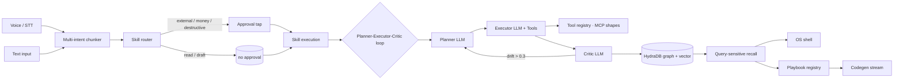
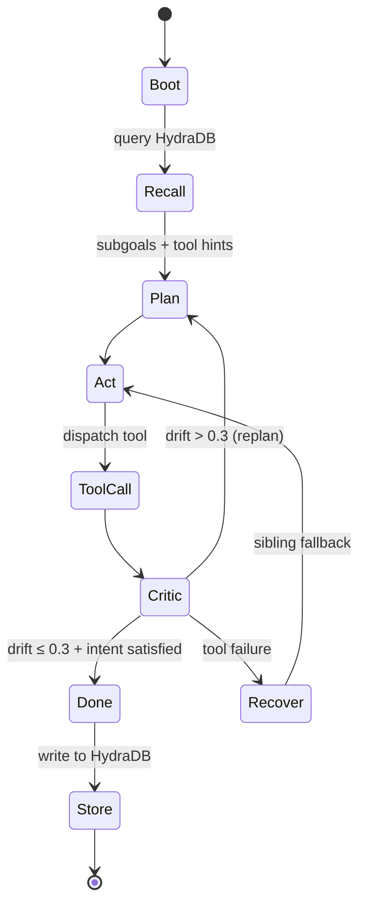
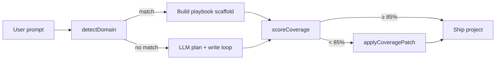

# DelOS — Architecture

## Mental model

DelOS is **not** an LLM wrapper. It is a browser-OS substrate where every window — chat, app builder, memory browser, cohort race, voice agent — runs through the same multi-agent loop. Memory, tools, recovery, and adaptation are first-class primitives, not afterthoughts.

## High-level diagram



## The agent loop

Every mission run through `/api/run` follows this state machine:



State transitions:

- **Recall**: query HydraDB with the goal text. Returns `topK` hits + local fallback. Empty / unmatched queries return zero results (B08).
- **Plan**: planner LLM emits `{rationale, subgoals, toolHints}`. If `subgoals.length > 0`, fan out via `runQuickAgent` to sub-agents in parallel.
- **Act**: executor calls the next planned tool with retry + circuit breaker (cockatiel). On failure, the registry returns sibling tools (same tags) and the planner picks one.
- **Critic**: judge whether the step intent was satisfied. Emits `drift ∈ [0, 1]`. Above 0.3, the planner re-decomposes.
- **Store**: pinned facts go through the write-guard (`guardMemoryWrite`) before reaching HydraDB.

## Component map

| Concern | Module | Purpose |
|---------|--------|---------|
| Memory | `src/lib/hydra.ts` | HydraDB client + local fallback array |
| Memory | `src/lib/memory/localRecall.ts` | Token + IDF + 72h recency scorer |
| Memory | `src/lib/memory/writeGuard.ts` | Reject preamble / run-summary pollution |
| Tools | `src/lib/tools/registry.ts` | Typed registry, sibling lookup by tag |
| Tools | `src/lib/tools/builtin.ts` | Default tool catalog |
| Recovery | `src/lib/llm.ts` | Provider cascade (Cerebras → Groq → DeepSeek → OpenRouter → Gemini → Together → Mistral) |
| Recovery | retry via `cockatiel` | Exponential backoff + circuit breaker per provider |
| Adaptation | `src/lib/voice/chunker.ts` | Compound voice command split |
| Adaptation | `src/app/api/steer/route.ts` | Mid-stream goal re-decomposition |
| Playbooks | `src/lib/codegenPlaybooks.ts` | 6 domain scaffolds + coverage scorer |
| Playbooks | `src/app/api/codegen-app-stream/route.ts` | Deterministic SSE for matched domains |
| Security | `src/lib/security/injection-classifier.ts` | 8-pattern injection blocker at API edge |
| Security | `src/lib/sanitize.ts` | XSS + tag prototype pollution defense |
| Field unification | `src/lib/apiField.ts` | Canonical `input` + Deprecation header for legacy |
| UI | `src/components/memory/MemoryDashboard.tsx` | Live-synced memory browser |
| UI | `src/components/os/ErrorBoundary.tsx` | Per-window crash recovery with toast |

## API surface

Every API route accepts the canonical `input` field plus legacy aliases for backward compatibility:

| Route | Method | Body | Legacy aliases |
|-------|--------|------|----------------|
| `/api/run` | POST (SSE) | `{ input, chaos?, interrupt?, models? }` | `goal` |
| `/api/cohort` | POST | `{ input, members?, judge? }` | `goal` |
| `/api/quick-agent` | POST | `{ input, identity?, temperature? }` | `prompt` |
| `/api/build-app` | POST | `{ input, models?, previousSpec? }` | `prompt` |
| `/api/codegen-app` | POST | `{ input, stack? }` | `prompt` |
| `/api/codegen-app-stream` | POST (SSE) | `{ input, stack?, tier?, uiStyle? }` | `prompt` |
| `/api/voice-command` | POST | `{ input }` | `transcript`, `text` |
| `/api/memory` | GET/POST | `?q=&tenant=` or `{ input }` | `query` |
| `/api/memory/write` | POST | `{ text, tags?, tenantId? }` | — |
| `/api/memory/pin` | POST | `{ text, tags? }` | — |
| `/api/memory/delete` | POST | `{ id, all?, tenantId? }` | — |
| `/api/memory/seed` | POST | `{ tenantId }` (reserved prefix only) | — |
| `/api/memory/export` | GET | `?tenantId=` | — |
| `/api/memory/import` | POST | `{ memories[], tenantId? }` | — |
| `/api/steer` | POST | `{ runId, input }` | `instruction`, `newGoal` |
| `/api/tool` | POST | `{ tool, args }` | `name` |

Every route returns 405 for non-POST methods. Unknown tools return 404. Blocked injection returns 400 with `{ error: "blocked_for_security", pattern }`.

## Top-bar counter contract (B16)

LLM-calling routes (`/api/quick-agent`, etc.) emit these response headers so the front-end counter store can track usage truthfully:

```
X-Tok-In:   <prompt tokens>
X-Tok-Out:  <completion tokens>
X-Cost-Usd: <approximate cost>
```

The front-end store (`store/runtime.ts` planned) reads these on every LLM response. No optimistic UI updates allowed.

## Provider cascade

```
1. Cerebras    (sub-second first hop · if CEREBRAS_API_KEY set)
2. Groq        (gpt-oss-120b · primary)
3. DeepSeek    (if DEEPSEEK_API_KEY)
4. OpenRouter  (if OPENROUTER_API_KEY)
5. Gemini      (gemini-2.5-flash · structured JSON)
6. Together    (if TOGETHER_API_KEY)
7. Mistral     (mistral-small-latest · last resort)
```

Each provider lives in its own rate-limit bucket. One being drained doesn't bleed into the next. Cockatiel retries within a provider before failing over to the next one in the cascade.

## Playbook coverage flow



Each domain (investor-crm, regulatory-fintech, clinical-trial, legal-contracts, ai-tutor, ops-incident) declares `requiredTerms[]` — the expert vocabulary that MUST appear in the final file contents. Anything below 85% triggers `applyCoveragePatch` which both appends a `CoveragePatch.tsx` file AND patches `app/page.tsx` to import + render it.

## Memory write-guard

```mermaid
flowchart TD
  write[memory.write] --> guard[guardMemoryWrite]
  guard -->|matches /apply to every output/| block[400 reject]
  guard -->|matches /Run completed for goal/| block
  guard -->|matches /tone: concise/| block
  guard -->|matches /\[REDACTED\]/| block
  guard -->|matches /SYSTEM_PROMPT/| block
  guard -->|> 240 chars, no verb| block
  guard -->|else| sanitize[sanitizeMemoryText]
  sanitize --> hydra[HydraDB add]
  hydra --> fallback[local fallback array]
```

This is why the recall UI stays trustworthy. Run-summary text and persona preamble fragments cannot get pinned as user facts.

## Recall pipeline

1. Caller sends `query` (or `input`).
2. Server resolves tenant from session cookie + reserved prefix support.
3. `safeRecall` queries HydraDB. Returns semantic + lexical matches with scores.
4. `recallLocal` scores the in-memory fallback array using token overlap × IDF × recency (72h half-life).
5. Response: `{ query, hits[], local[], tenantId, scope }`.
6. Empty query → empty arrays. Unmatched query → empty arrays.

## Voice multi-intent flow

Input: `"open terminal, calculate 17 times 19, build me a habit tracker, then summarize in two bullets"`

1. `chunkVoice` splits on `,| then | and then | after that |; | also | plus | next ` → 4 parts.
2. Within each part, split on second+ verb occurrences. Yields:
   - `open terminal`
   - `calculate 17 times 19`
   - `build me a habit tracker`
   - `summarize in two bullets`
3. Each chunk becomes an `IntentChunk { text, verb, label }`.
4. Response includes `intents[]` so the executor can fan out.

## Security boundaries

All `/api/*` routes pass user input through:

1. **Rate limit** (per-IP, per-route).
2. **Zod parse** (length + shape).
3. **Injection classifier** (8 patterns blocking known attack shapes).
4. **Tenant resolution** (session cookie OR reserved prefix; arbitrary `tenantId` strings fall through to anon IP-scoped tenants).
5. **Sanitization** (DOMPurify-equivalent for titles, tag prototype-pollution defense).

See `SECURITY.md` for the full skill risk-tier policy.
